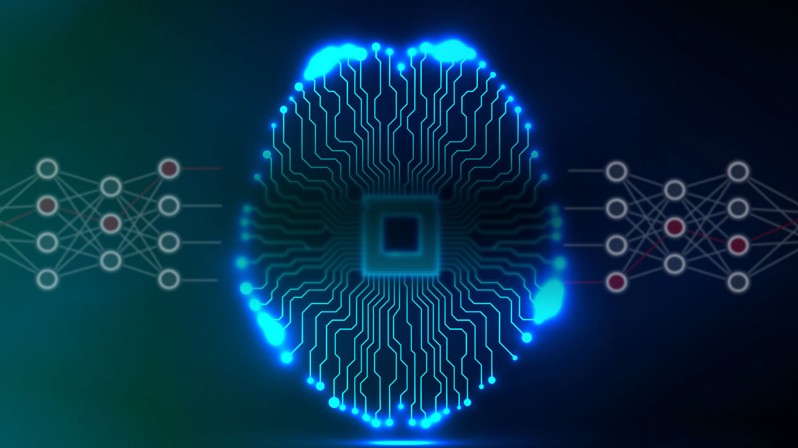

# Курс по нейронным сетям 2019-2020: продвинутый поток

Официальный сайт Школы Глубокого Обучения при [ФПМИ МФТИ](https://mipt.ru/education/departments/fpmi/): www.dlschool.org  
[Репозиторий прошлого года](https://github.com/DLSchool/deep_learning_2018-19)

<table width="100%">
    <tr>
        <td width="50%">
            <H2>Введение в современный ИИ и нейронные сети</H2>
            

                 <a href="https://www.youtube.com/watch?time_continue=3820&v=RviskFqwF3M">video</a> |
                 <a href="https://cloud.mail.ru/public/BaEv/BWr96KK4U">slides</a> |
                 <a href="">colab</a> |
                 <a href="">code</a>  

            Лекция про современное состояние Искусственного интеллекта и его применения. Читает Михаил Бурцев (руководитель проекта iPavlov, заведующий лабораторией нейронных систем и глубокого обучения МФТИ).
        <td width="50%"></td>
    </tr>
</table>
 
 
 
